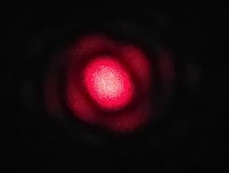
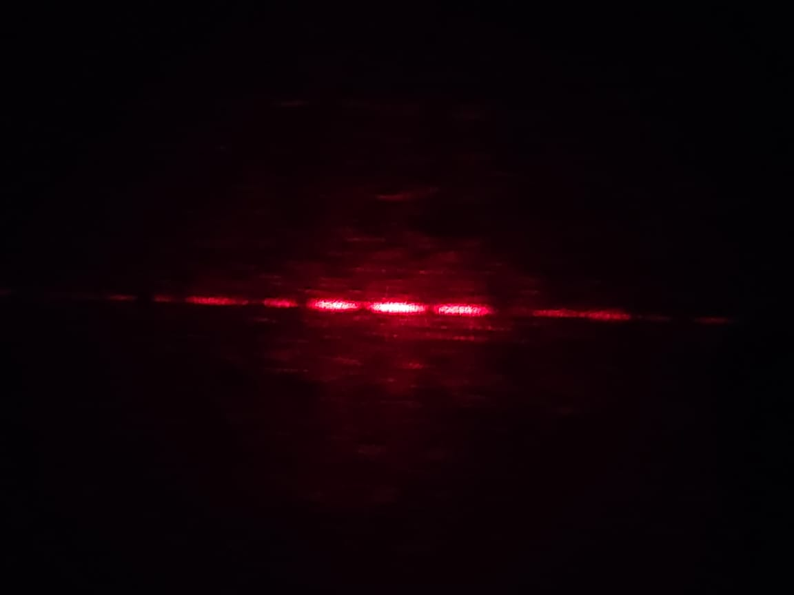
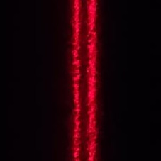
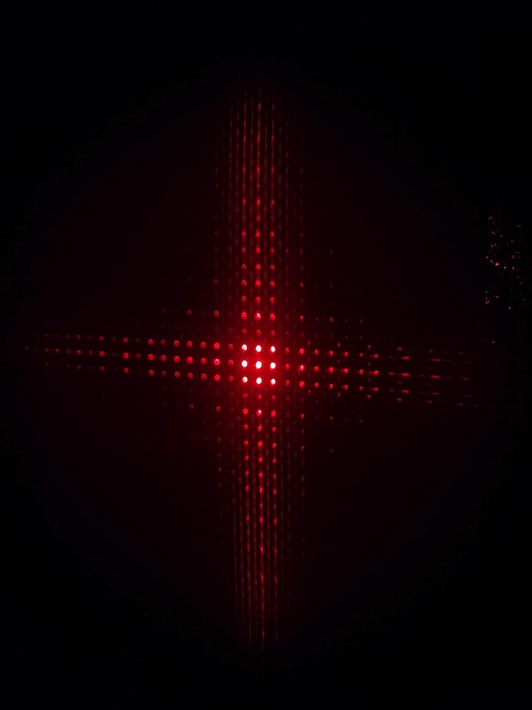
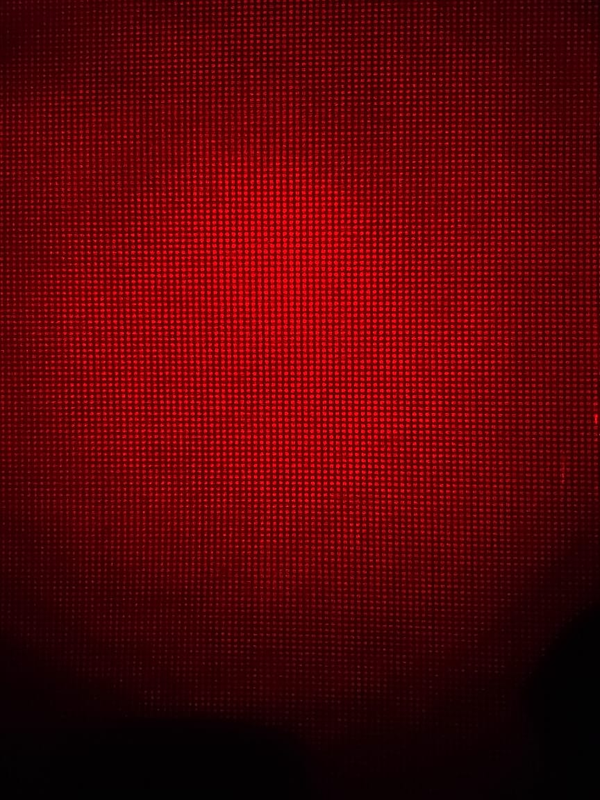
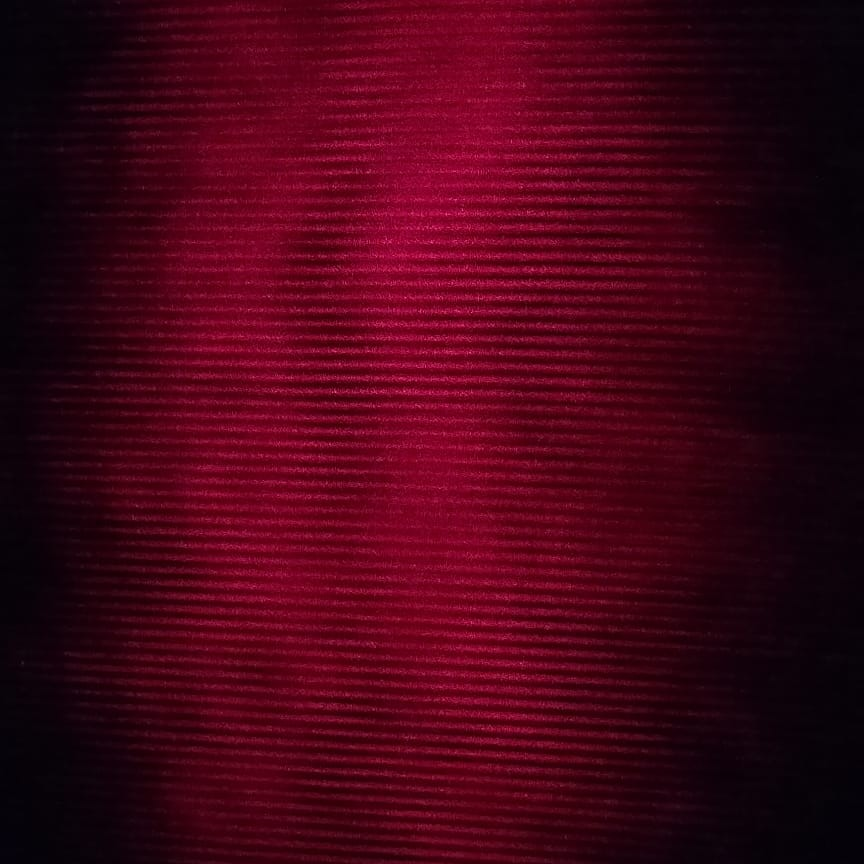
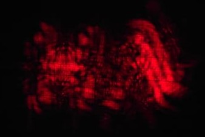
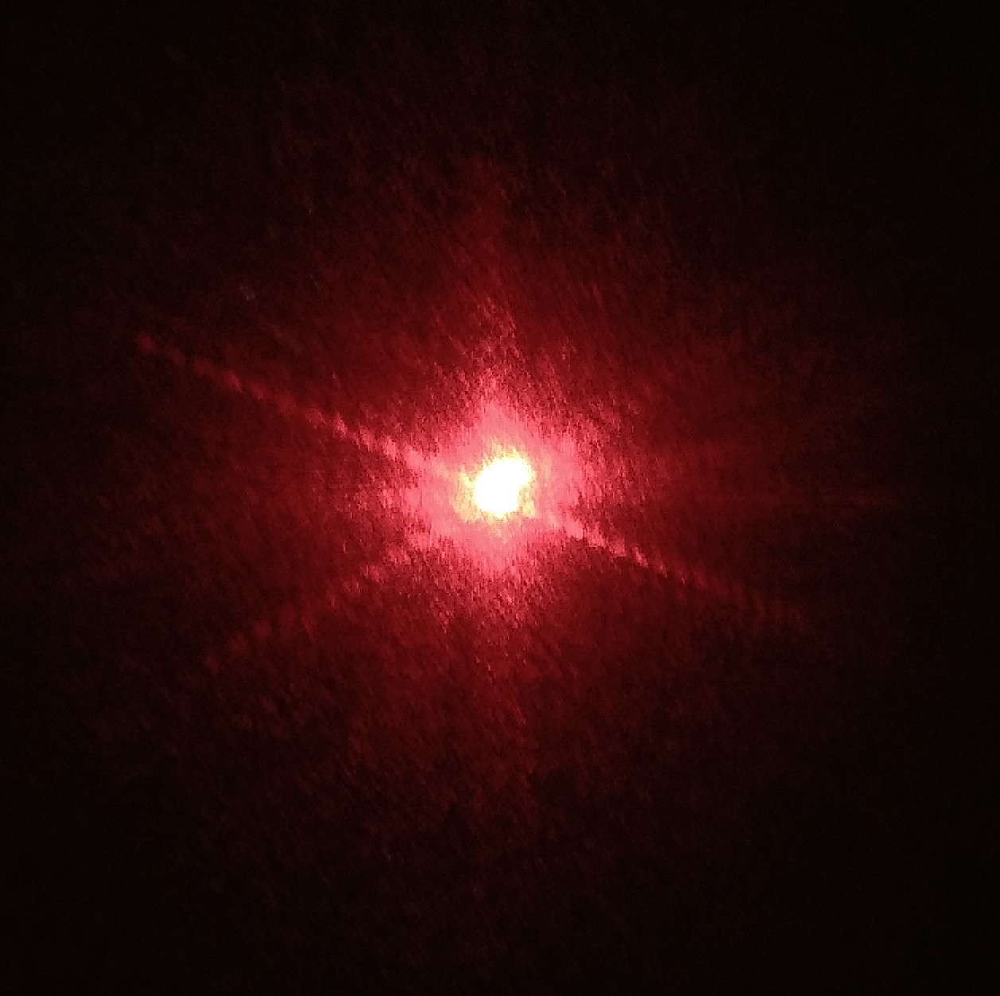

# Updates of the Fourier Optics Open Lab experiment

Here you can find the updates of the Fourier Optics Open Lab experiment.

## Updates

### Week 1

Just read the manual and got acquainted with the idea of the experiment.

### Week 2

- **Tuesday**
  - Read the manual and learned how fourier transform of light works.
  - We made a list of equipments and components we need for the experiment.
- **Wednesday**
  - We brought the required equipments from the optics lab.
  - Although we got most of the equipments, we still need to get some more equipments like holders and filters, etc.
  - We then designed the 3d models tailored as per our requirements and then printed them.
- **Thursday**
  - We completed the models and put them for printing.
  - 3d model of Bracket to hold mask: [STL File 1](3d_Designs_and_DXFs/Bracket.stl), [STL File 2](3d_Designs_and_DXFs/Holder.stl)
  - 3d model of Bracket to hold filters: [STL File](3d_Designs_and_DXFs/Filter%20Holder.stl)

### Week 3

- **Tuesday** (holiday)
- **Wednesday**
  - We got the 3d printed models and then assembled them, then we aligned the laser and the lenses on the optical bench.
  - We played with the existing objects present in the lab and generated their fourier transform images.

- **Thursday**
  - We got some new filters and then we tried to generate the fourier transform of the new filters.

### Week 4

- **Tuesday**
  - Last week we had started experimenting with the new filters we got. Today we started doing the same in a more organised manner. We took a lot of photos. Here are some of the photos which came good.
    - fourier transform of pin hole

      

    - fourier transform of double slit

      

    - reconstruction of double slit

      

    - fourier transform of mesh

      

    - reconstruction of mesh

      

    - mesh, but we only let the central vertical set of dots pass through

      

- **Wednesday:** We did all the experiments we did yesterday in simulation (Python). Results were similar. We got acquainted with the [diffractio](https://pypi.org/project/diffractio/) library of python. The results are in the jupyter notebook.

- **Thursday:**
  - We talked to Sudakshina maam. She told us if we can take multiple characters, do the fourier transform, and put some filter such that only some of the characters will come in the reconstruction, it would be a good idea.
  - We downloaded the [imagej](https://imagej.net/ij/download.html) software and started experimenting with different shapes and filters. We got some observations:
    - If we have a straight line in the image, we will get a straight diffraction pattern rotated by 90 degrees. If we have multiple straight lines, they would just superimpose on each other.
    - Relative spacial features are lost in the fourier transform. For example, the fourier transform of T and L will be the same. The information that the horizontal line is at the top of the vertical line in T and at the bottom of the vertical line in L is lost. (although when we reconstruct the image, we can see the difference)
    - This is the reason, we can remove all the horizontal features in the image everywhere, just by putting a single vertical wire in the fourier transform plane.
    - The central part of the fourier transform is always very bright and is mostly responsible for brightness of the image and contributes all the low frequency features. Hence if the object is a square hole and we put out the center from the fourier transform, we will get a dim square border with both the center and the outside dark.
    - Brighter dots carry more information than the dimmer ones.
    - **"O"** cannot be filtered out. It is a circle; so it has features in all directions. Hence with the motivation of allowing features of some other character, if we make a filter, it will always pass a major portion of the "O" character.
  - After extensive trial and testing, we agreed upon the letters **V** and **H**. For V we expect to see a cross ($\times$) in the fourier plane and for H we expect to see a plus (+) in the fourier. These two letters do not have anything in common in the fourier plane, so it will be pretty easy to filter out one of them. (Moreover, the letters **VH** together when reconstructed will get inverted. The inverted letters will look something like **HA** which will just be hillarious.)

### Week 5

- **Tuesday:**
  - **Time to make the Object!** Our job was to make very small holes in the shape of **V** and **H** in a black paper. It would be too untidy and hectic to make the holes by hand. So we decided to use a laser cutter. We made the designs in Onshape and exported them as `.dxf` files. The files are here: [DXF for V](./3d_Designs_and_DXFs/v.dxf), [DXF for H](./3d_Designs_and_DXFs/h.dxf). We then used the laser cutter to cut the shapes in a thick black chart paper. Although the cutting was exactly as large as we had designed on Onshape, it seemed smaller than our expectations, so we made 2 versions, one 2X larger than the original and one 3X larger than the original. We increased this size in the laser cutter software only, so we do not have specific `.dxf` files for them.
  - Although the laser cutter was really precise, and the object was also a couple of millimeters big, we could not get the desired the fourier transform from it. We just got a very bright dot in the middle and nothing else.
- **Wednesday:**
  - Today we gave it a thought and realised that, the laser cutter anyway burns out a part of the paper and makes a hole. So, there is no need for us to make two parallel lines to make a line, a single line would be thinner and would be enough.
  - We experimented a lot with the power of the laser to use and the speed of the head with some waste paper (this really took a while, and we got lots of insights about the laser cutting procedure also). The machine has two parameters which helps us control the type of cut required. They are power and speed. Increasing power burns the paper faster and the beam diameter slightly increases at low powers. Higher speeds make the head move faster and thus the surface gets less time to burn. It might seem that we should use very low power and very high speed to get the finest cuts, but there is more to it. We had a really thick paper. So, the laser at the lowest speed needed some time to burn the paper. If we increase the speed, the laser would not be able to burn the paper completely. The minimum head speed was 3 (unit we don't know) which was not less enough to burn the paper. So we had to increase the power from 15 (least possible) to 20 (again, we don't know the unit). Then we saw that at speed = 5, a very fine hole was being made, but the sides had some irregularities. At speed = 10, the hole was almost as fine as at speed = 5, but the sides were much more regular. So we decided to go with **speed = 10** and **power = 20**.
  - We came back to the LAB with much thinner "VH"s this time, but still it didn't work. Again we got a single bright dot and nothing else. But the reconstruction was working.
  - We talked to Sudakshina maam and she suggested although we cannot see the diffraction pattern, we might try using some filters we had on that dot only and see the results. We had a filter where there are two wires come and make a plus (+) sign. We used a small horizontal part of it to filter out all the vertical lines in the image. The reconstruction came out to be like this:

    

    Then we tried blocking the center of the fourier transform (by rotating the same + filter by $45\degree$, this won't block the V cross because they are not at 45 degree, V ones are at a smaller angles) and the reconstruction came out to be like this:

    
- **Thursday:**
  - We came up with a very good plan while playing with the instruments. We moved the last lens (which was helping in doing the inverse fourier transform and reconstruct the image) much farther. We came to know that the image will anyway be reconstructed without even a lens. So, now let us calculate. After the object we are having a convex lens. The fourier transform is made at it's focus (asuming parallel beam from other side). Another `f` distance away we had the last lens which was helping us in reconstruction. But as mentioned, this lens is praactically useless, image comes almost as good (and much larger) without this. So, we can assume that at `2f` distance from the first lens, there we will have the inverted image. Practically this image is actually bigger than the object... after this I forgot what complex thing I did that day... I will go to LAB on Tuesday and will update this... anyway the result was... we had a bigger fourier transform after a long distance (on the wall) which had all the predicted parts, and we were happy. Here have a look:

    

    We have both the plus for the H and the cross for the V.
  - But with this modified experiment, we needed a much larger distance to filter and do the reconstruction. I asked for a mirror to increase the optical path, but that was not available, so we planned to move the whole setup back where the Desktop was kept, to have somewhat larger distance. Now let us see what we can do with this setup.

**Note:** In the images of Wednesday this week, a grid can be visible. It is not due to any optical phenomenon related to our experiment. The screen we used had a graph paper attached to it. The graph paper had green grids, which absorbed the red laser lights. Hence we can see a black grid in the images.
