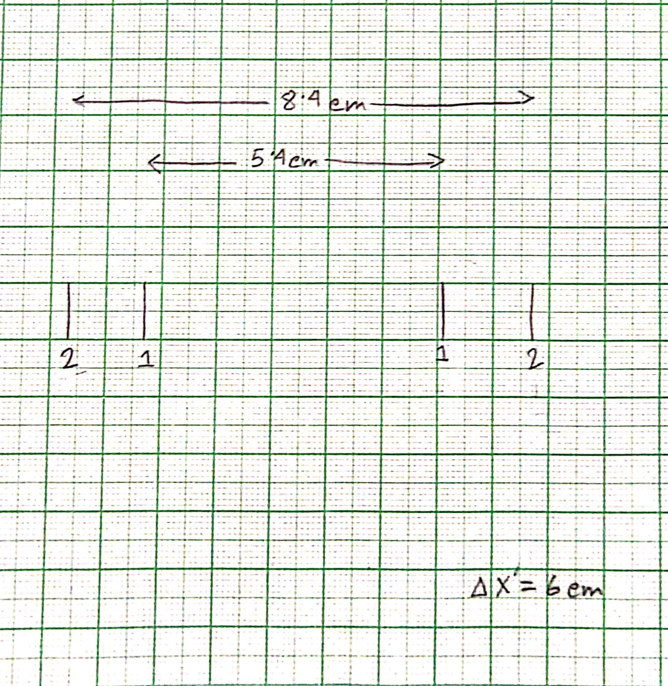

# Updates of the Open Lab (semester 7)

Welcome to our GitHub repository dedicated to tracking the progress of our optical fiber project. Here, we'll be sharing regular updates on our work. Stay tuned to follow our journey in the world of optical fibers.

## Work to complete

- ✅ Fiber-end Preparation and Light Coupling
- ✅ Numerical Aperture Measurement
- ❌ ~~Mode Field Diameter of a Single-Mode Fiber~~
- ❌ ~~Refractive Index Profile of a Multimode Fiber~~
- ❌ ~~Fiber-to-Fiber (Multimode) Splice Loss~~
- ❌ ~~Microbending Loss and Application in Sensing~~
- ❌ ~~Bend-induced Loss in a Single-Mode Fiber~~
- **Fiber Optic Communication System** (Final Plan Proposed by us because the apparatus for doing the remaining experiments were either unavailable or broken)

## Updates

### Week 1

- **Tuesday: 08/08/2023**
  - Read the [manual](manual.pdf)
  - Peeled optical fiber coating
  - Washed with acetone
  - Cut it using fiber cleaver and blade
  - Started mounting the laser on optical breadboard
- **Wednesday: 09/08/2023**
  - Read the [manual](manual.pdf)
  - We encountered challenges in preparing and mounting the optical fiber. We addressed issues with screw compatibility, inadequate tools, and height disparities between the laser and fiber mounts. Disassembling the mounts revealed missing screws and worn breadboard holes. Despite efforts to overcome these hurdles, we couldn't complete our tasks due to unforeseen complications, prompting us to conclude our efforts for the day.
- **Thursday: 10/08/2023**
  - On the following day, we tackled the height issues by realigning the laser in a different row, and by creatively replacing larger screws with smaller ones in the laser mount to lower its height.
  - While dealing with missing screws in one optical fiber mount, we employed a practical solution by swapping screws between the two mounts. Remarkably, the second mount, although having screws in the same position, functioned effectively without one specific screw, which we then transferred to the first mount.
  - Unforeseen complications led to the end of the optical fiber breaking, necessitating a repeat of the peeling, washing, and cutting process.
  - With a focus on preserving accurate light transmission, we intentionally positioned the input and output ends of the optical fiber in separate rows. This strategic arrangement underscored the critical principle that all light emerging from the fiber's end had traversed the entire length of the optical fiber.

### Week 2

- **Tuesday: 15/08/2023** (Holiday for Independence Day)
- **Wednesday: 16/08/2023**
  - Previously we were using a holding stand for the laser which was not suitable for our experiment. So we decided to use a different stand which was better suitable for our experiment with XYZ axis movement.
  - Then  we checked the amount of light coming out of the fiber using a intensity sensor (photo diode). We measured the intensity of the light coming directly from the laser (400mv) and then we measured the intensity of the light coming out of the fiber (260mv). The intensity values are in millivolts because we were using a multimeter to measure the electricity produced by the photo diode. From the values we can say that we have a good 65% of the incident light coming out of the fiber on the other hand. We thought this is a good enough value accounting for the presence of various absorbing impurities in the lens and the air in the room. Moreover, the lights which are falling above a particular angle not getting transmitted through the fiber. Thus our next job was to find out the maximum angle which the light can make with the fiber axis and still get transmitted through the fiber.
  
  - In [image 1](#week2-scematics1) we have shown the schematic of the experiment.
  - The light coming out of the end of the fiber was making a cone shape. So we put a screen (with a graph paper attached to it) more or less perpendicular to the axis of the cone. We got a circular spot on the  screen. We measured it's diameter. It came out to be 5.4cm. Next we moved the screen and noted the distance moved (6cm) and took another reading where the circle was bigger (8.4cm). We have attached the picture of the graph paper in [image 2](#week2-graph1).
  
- **Thursday: 17/08/2023**
  - We know that $\text{NA} = \sin{\theta}$. From [image 1](#week2-scematics1) we see that $\tan \theta = \frac{(8.4 - 5.4)/2}{6} = 0.5$.
  $\therefore \text{NA} = \sin \theta = \frac{0.5}{\sqrt{1 + 0.5^2}} = 0.447$

  **Note:** The work done on Wednesday was actually done on both Wednesday and Thursday, but for the sake of simplicity we have mentioned it all under Wednesday.

### Week 3

- **Tuesday: 22/08/2023**
  - We saw that Expt 3 (Mode Field Diameter of a Single-Mode Fiber) needed a single mode fiber. We wanted to complete all the ones which needed a multimode fiber first. So we decided to do Expt 4 (Refractive Index Profile of a Multimode Fiber) next.
  - For Expt 4, we needed a Tungsten Halogen Lamp (THL). We didn't have that, so we requested the lab in-charge to arrange one for us. He gave us one which was not working. So he said he will try to arrange one for us by tomorrow from the solid state lab solar experiment. We saw that the power supply was working fine.
- **Wednesday: 23/08/2023**
  - We investigated the lamp and found that it was fused. We were told that we don't have spare parts for the lamp. We explored a lot of possibilities to find a replacement option for the Lamp. Any **non-coherent** light source would work. We thought about getting a sodium lamp from the optics lab and a lens to converge the beam to a point. While searching for those items we came to know that the optics lab has spare parts for our lamp. So we replaced the fused bulb with a new one and the lamp started working. Yay!
  - We also got a new smaller stand for the lamp because Swayam took the one which we were using. The new one although not ideal for our case, was good enough for our experiment.
  - We then set the lamp up and found out that just like the laser, this lamp is also getting us around 60% transmission through the optical fiber ($\frac{0.3V}{0.51V}\times 100 \% \approx 60\%$)
- **Thursday: 24/08/2023**
  - Oh No! the fiber end broke again! 😢 Again had to do the peeling, washing and cutting process.
  - We found that, most of the apparatus required for the remaining experiments is either missing or broken. So, in the end we decided to design and build our own experiment. We will be using the lab's apparatus only for the experiments which we have already done.
  - So, now we are going to try to build a communication device using signal transmission through the optical fibre as our final project. For now, we are planning to use the lab's apparatus and arrange some LEDs and photo diodes to transmit and receive the signal. We will be controlling our signal using an Arduino.
